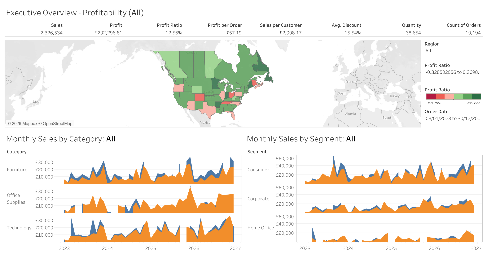
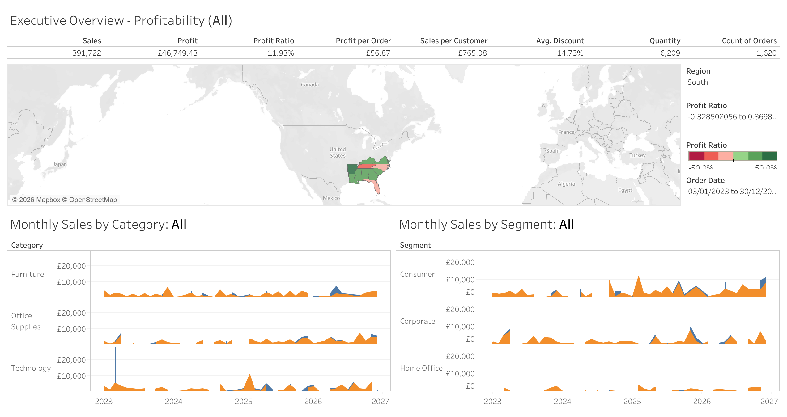
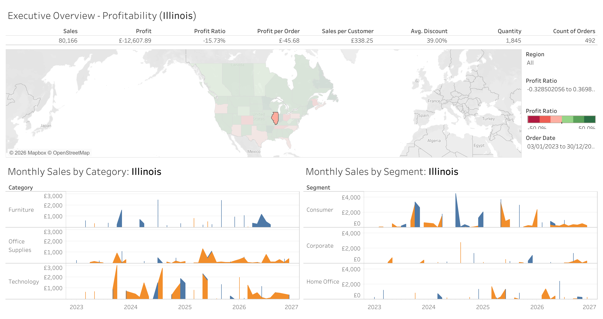
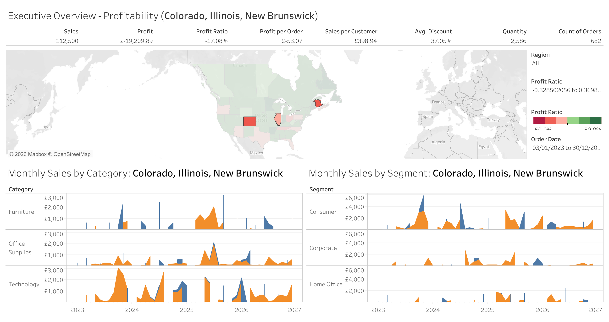

# Executive Overview Dashboard (Tableau)

## Project Overview

This project presents an interactive Tableau dashboard built using the Sample Superstore dataset.

The dashboard provides executive-level insights into:

- Sales Performance
- Profitability
- Customer Segments
- Geographic Trends
- Regional Performance

---

## Dashboard Previews

### 1. All Cities Overview

Provides a complete business overview across all regions, categories, and customer segments.

---

### 2. South Region Analysis

Focused analysis of the South region, highlighting sales trends, profitability, and customer behaviour.

---

### 3. Illinois Analysis

Detailed state-level analysis showing business performance within Illinois.

---

### 4. Multi-Location Overview

Dashboard filtered to Colorado, Illinois, and New Brunswick, allowing stakeholders to explore key business metrics for a selected group of locations.

---

## Key Performance Indicators

The dashboard tracks:

- Total Sales
- Total Profit
- Profit Ratio
- Profit per Order
- Sales per Customer
- Average Discount
- Quantity Sold
- Count of Orders

---

## Features

- Interactive Date Filters
- Region Filters
- Geographic Mapping
- Category Analysis
- Customer Segment Analysis
- Executive KPI Cards
- Dynamic Dashboard Interactions

---

## Files Included

| File | Description |
|--------|--------|
| Executive Overview.twbx | Tableau workbook |
| sampleSuperstore.xls | Source dataset |
| all-cities-overview.png | Full dashboard view |
| south-region-overview.png | South region analysis |
| illinois-overview.png | Illinois analysis |
| colorado-illinois-new-brunswick-overview.png | Multi-Location Overview |

---

## Technologies Used

- Tableau Public
- Microsoft Excel
- Business Intelligence
- Data Visualization

---

## Author

Uvietobore Joshua Adjugah
MSc Data Science & Artificial Intelligence
London, United Kingdom
